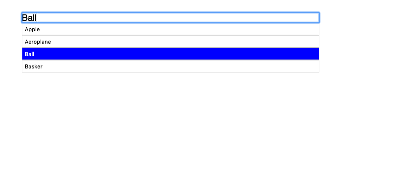
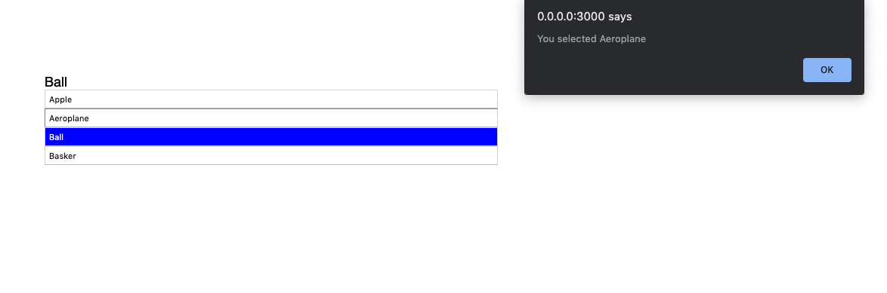

## About

This is a skeleton for a typeahead component.

## Props

1. defaultValue: defaultValue from one of the option list
2. options: Array of strings
3. onSelect: function callback once a value is selected, returns value selected
4. placeholder: placeholder for search input

## Styling

1. typeahead-container: the overall container of the component you can change width, background color, color and font size, make sure the font to be used is defined here as well.

2. typeahead-sub-container: the sub container doesn't need to be modified

3. typeahead-suggestion-container: the container for suggestion text that are to be displayed

4. typeahead-input: the search bar for the component

5. typeahead-search-container: container for the result that are changed according to what user types.

6. typeahead-search-item: individual item in the search container

7. typeahead-search-container > .active: the current selected from the list

## Output

## Demo

https://karkipy.github.io/typeahead/index.html